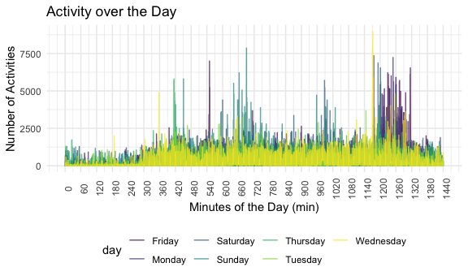
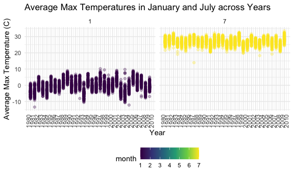
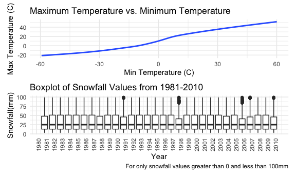

Homework 3
================
Mufeng Xu
2020-10-10

### Problem 1

``` r
data("instacart")
```

This dataset contains 1384617 rows and 15 columns.

Observations are the level of items in orders by user. There are user /
order variables – user ID, order ID, order day, and order hour. There
are also item variables – name, aisle, department, and some numeric
codes.

How many aisles, and which are most items from?

``` r
instacart %>% 
    count(aisle) %>% 
    arrange(desc(n))
```

    ## # A tibble: 134 x 2
    ##    aisle                              n
    ##    <chr>                          <int>
    ##  1 fresh vegetables              150609
    ##  2 fresh fruits                  150473
    ##  3 packaged vegetables fruits     78493
    ##  4 yogurt                         55240
    ##  5 packaged cheese                41699
    ##  6 water seltzer sparkling water  36617
    ##  7 milk                           32644
    ##  8 chips pretzels                 31269
    ##  9 soy lactosefree                26240
    ## 10 bread                          23635
    ## # … with 124 more rows

Let’s make a plot

``` r
instacart %>% 
    count(aisle) %>% # number the items ordered in each aisle
    filter(n > 10000) %>% # limiting aisles with >10000 items
    mutate(
        aisle = factor(aisle),
        aisle = fct_reorder(aisle, n)
    ) %>% 
    ggplot(aes(x = aisle, y = n)) +  
    geom_point() + # scatterplot
    theme(axis.text.x = element_text(angle = 90, vjust = 0.5, hjust = 1)) # rotate the axies 90 degrees
```


Let’s make a table\!\!

``` r
instacart %>% 
    filter(aisle %in% c("baking ingredients", "dog food care", "packaged vegetables fruits")) %>% 
    group_by(aisle) %>% 
    count(product_name) %>% 
    mutate(rank = min_rank(desc(n))) %>% 
    filter(rank < 4) %>% 
    arrange(aisle, rank) %>% 
    knitr::kable()
```

| aisle                      | product\_name                                 |    n | rank |
| :------------------------- | :-------------------------------------------- | ---: | ---: |
| baking ingredients         | Light Brown Sugar                             |  499 |    1 |
| baking ingredients         | Pure Baking Soda                              |  387 |    2 |
| baking ingredients         | Cane Sugar                                    |  336 |    3 |
| dog food care              | Snack Sticks Chicken & Rice Recipe Dog Treats |   30 |    1 |
| dog food care              | Organix Chicken & Brown Rice Recipe           |   28 |    2 |
| dog food care              | Small Dog Biscuits                            |   26 |    3 |
| packaged vegetables fruits | Organic Baby Spinach                          | 9784 |    1 |
| packaged vegetables fruits | Organic Raspberries                           | 5546 |    2 |
| packaged vegetables fruits | Organic Blueberries                           | 4966 |    3 |

Apples vs ice cream..

``` r
instacart %>% 
    filter(product_name %in% c("Pink Lady Apples", "Coffee Ice Cream")) %>% 
    group_by(product_name, order_dow) %>% 
    summarize(mean_hour = mean(order_hour_of_day)) %>% 
    pivot_wider(
        names_from = order_dow,
        values_from = mean_hour
    ) %>% 
  knitr::kable()
```

    ## `summarise()` regrouping output by 'product_name' (override with `.groups` argument)

| product\_name    |        0 |        1 |        2 |        3 |        4 |        5 |        6 |
| :--------------- | -------: | -------: | -------: | -------: | -------: | -------: | -------: |
| Coffee Ice Cream | 13.77419 | 14.31579 | 15.38095 | 15.31818 | 15.21739 | 12.26316 | 13.83333 |
| Pink Lady Apples | 13.44118 | 11.36000 | 11.70213 | 14.25000 | 11.55172 | 12.78431 | 11.93750 |

### Problem 2

Load, Tidy and Wrangle the data

``` r
accel_df = read.csv(
  "./data/accel_data.csv") %>% 
  janitor::clean_names() %>% 
  pivot_longer(
    activity_1:activity_1440,
    names_prefix = "activity_",
    names_to = "minute_of_the_day",
    values_to = "activity_count"
  )

# Create a "day" dataframe to arrange the dates in order
day_df = 
  tibble(
    day_num = 0:6,
    day = c("Sunday", "Monday", "Tuesday", "Wednesday", "Thursday", "Friday", "Saturday")
  )

# Join the accel_df and day_df together
accel_tidy = 
  left_join(accel_df, day_df, by = "day") %>% 
  mutate(
    day = as.factor(day),
    minute_of_the_day = as.integer(minute_of_the_day)
  ) %>% 
  mutate(
    weekday_vs_weekend =
      case_when(day_num == 1:5 ~ "weekday", day_num == 0 ~ "weekend", day_num == 6 ~"weekend"),
    weekday_vs_weekend = as.factor(weekday_vs_weekend)
  ) %>% 
  relocate(week, day, day_num, weekday_vs_weekend, minute_of_the_day) %>% 
  arrange(week, day_num, minute_of_the_day)
accel_tidy
```

    ## # A tibble: 50,400 x 7
    ##     week day    day_num weekday_vs_weeke… minute_of_the_d… day_id activity_count
    ##    <int> <fct>    <int> <fct>                        <int>  <int>          <dbl>
    ##  1     1 Sunday       0 weekend                          1      4              1
    ##  2     1 Sunday       0 weekend                          2      4              1
    ##  3     1 Sunday       0 weekend                          3      4              1
    ##  4     1 Sunday       0 weekend                          4      4              1
    ##  5     1 Sunday       0 weekend                          5      4              1
    ##  6     1 Sunday       0 weekend                          6      4              1
    ##  7     1 Sunday       0 weekend                          7      4              1
    ##  8     1 Sunday       0 weekend                          8      4              1
    ##  9     1 Sunday       0 weekend                          9      4              1
    ## 10     1 Sunday       0 weekend                         10      4              1
    ## # … with 50,390 more rows

The study examines “the accelerometer data collected on a 63 year-old
male with BMI 25, who was admitted to the Advanced Cardiac Care Center
of Columbia University Medical Center and diagnosed with congestive
heart failure(CHF)”. The study duration is 35 days, and 1440 minutes per
day. After tidying and wrangling the original data, the resulting
dataset has 50400 rows(observations) and 7 columns(variables), including
variables of activity\_count, day, day\_id, day\_num,
minute\_of\_the\_day, week, weekday\_vs\_weekend with corresponding
class of integer, factor, integer, factor, integer, integer, numeric.

Find the total activity of each day

``` r
accel_summary = 
  tibble(accel_tidy) %>% 
  group_by(week, day) %>% 
  summarize(activity_count_of_the_day = sum(activity_count)) %>% 
  pivot_wider(
    names_from = day,
    values_from = activity_count_of_the_day
  ) %>% 
  relocate('week', 'Sunday', 'Monday', 'Tuesday', 'Wednesday', 'Thursday', 'Friday', 'Saturday') %>% 
  mutate(
    week_average = mean(Sunday:Saturday)
  )
```

    ## `summarise()` regrouping output by 'week' (override with `.groups` argument)

``` r
print(accel_summary)
```

    ## # A tibble: 5 x 9
    ## # Groups:   week [5]
    ##    week Sunday  Monday Tuesday Wednesday Thursday  Friday Saturday week_average
    ##   <int>  <dbl>   <dbl>   <dbl>     <dbl>    <dbl>   <dbl>    <dbl>        <dbl>
    ## 1     1 631105  78828. 307094.   340115.  355924. 480543.   376254      503680.
    ## 2     2 422018 295431  423245    440962   474048  568839    607175      514596.
    ## 3     3 467052 685910  381507    468869   371230  467420    382928      424990 
    ## 4     4 260617 409450  319568    434460   340291  154049      1440      131028.
    ## 5     5 138421 389080  367824    445366   549658  620860      1440       69930.

From looking at the week averages for each week, it can be observed that
the patient has similar number of activities on week 1 and week 2. As
passing on to week 3, the number of activities decreases a bit. On week
4 and 5, number of activities significantly decreases. Week 2 \> Week 1
\> Week 3 \>\> Week 4 \> Week 5. For week 1-5, the average activities in
a day are

|           |        x |
| :-------- | -------: |
| week      |      3.0 |
| Sunday    | 383842.6 |
| Monday    | 371739.8 |
| Tuesday   | 359847.6 |
| Wednesday | 425954.4 |
| Thursday  | 418230.1 |
| Friday    | 458342.1 |
| Saturday  | 273847.4 |

It shows that the patients have the least activities on Saturdays, and
the most activities on Fridays. Friday \> Wednesday \> Thursday \>
Sunday \> Monday \> Tuesday \> Saturday.

Make a plot

``` r
accel_tidy %>% 
  ggplot(aes(x = minute_of_the_day, y = activity_count, color = day)) +
  geom_line(alpha = 0.7) +
  labs(
    title = "Activity over the Day",
    x = "Minutes of the Day (min)",
    y = "Number of Activities"
  ) +
  scale_x_continuous(
    breaks = seq(0, 1440, by = 60)
  ) +
  theme(axis.text.x = element_text(angle = 90))
```



Based on the single-panel plot, it can be observed that from 0am to 5am,
the patient has a very small number of activities; from 5am (300min) and
on, the patient starts to have a larger number of activities. On several
days of the week, the patient has peak numbers of activities around:
7am, 10am to 12:30pm(Sundays); 9pm (Mondays); no obvious peak for
Tuesdays; 6am, 7:30pm(Wednesday); 7am(Thursday); 9am and 8:30pm to 10pm
(Fridays); 4:30pm, 8pm(Saturday).

## Problem 3

``` r
data("ny_noaa")
```

The original dataset `ny_noaa` contains 2595176 rows and 7 columns,
containing variables of date, id, prcp, snow, snwd, tmax, tmin. It
describes different weather parameters - precipitation(tenths of mm),
snowfall(mm), snow patch(mm), maximum and minimum temperature (tenths of
degree Celsius) - in different weather stations over years. From the
data set, the table below shows the missing values of each variable.

``` r
summary(ny_noaa)
```

    ##       id                 date                 prcp               snow       
    ##  Length:2595176     Min.   :1981-01-01   Min.   :    0.00   Min.   :  -13   
    ##  Class :character   1st Qu.:1988-11-29   1st Qu.:    0.00   1st Qu.:    0   
    ##  Mode  :character   Median :1997-01-21   Median :    0.00   Median :    0   
    ##                     Mean   :1997-01-01   Mean   :   29.82   Mean   :    5   
    ##                     3rd Qu.:2005-09-01   3rd Qu.:   23.00   3rd Qu.:    0   
    ##                     Max.   :2010-12-31   Max.   :22860.00   Max.   :10160   
    ##                                          NA's   :145838     NA's   :381221  
    ##       snwd            tmax               tmin          
    ##  Min.   :   0.0   Length:2595176     Length:2595176    
    ##  1st Qu.:   0.0   Class :character   Class :character  
    ##  Median :   0.0   Mode  :character   Mode  :character  
    ##  Mean   :  37.3                                        
    ##  3rd Qu.:   0.0                                        
    ##  Max.   :9195.0                                        
    ##  NA's   :591786

By using the summary function (output below), we can see there is data
missing for all five of the weather-related variables.

Clean and Tidy the dataset

``` r
ny_noaa = 
  tibble(ny_noaa) %>% 
  janitor::clean_names() %>% 
  mutate(
    year = lubridate::year(date),
    month = lubridate::month(date),
    day = lubridate::day(date)
  ) %>% # separate year, month, date
  mutate(
    prcp = prcp / 10,
    tmax = as.numeric(tmax) / 10,
    tmin = as.numeric(tmin) / 10
    ) %>% 
  filter(!is.na(tmax)) %>% 
  arrange(id, year, month, day) %>% 
  relocate(id, year, month, day)

ny_noaa %>% 
  count(snow) %>% 
  arrange(desc(n))
```

    ## # A tibble: 252 x 2
    ##     snow       n
    ##    <int>   <int>
    ##  1     0 1168636
    ##  2    NA  172647
    ##  3    25   17567
    ##  4    13   13716
    ##  5    51   10366
    ##  6     5    5963
    ##  7    76    5903
    ##  8     8    5782
    ##  9     3    5617
    ## 10    38    5582
    ## # … with 242 more rows

The most commonly observed values for snowfall is 0 because in general,
there is only snowfalls in winters. The dataset records a zero on each
and everyday there is no snowfalls.

Make Plots of the average max temperature in January and in July in each
station across years

First thing to do is to do some munipulations to the dataset:

``` r
ny_noaa_JJ = 
  tibble(ny_noaa) %>% 
  filter(month == "1" | month == "7") %>% 
  filter(!is.na(tmax)) %>% 
  select(-date, -prcp, -snow, -tmin, -snwd) %>% 
  group_by(id, month, year) %>% 
  summarize(
    tmax_average = mean(tmax, na.rm = TRUE)
      ) %>% 
  arrange(id, year, month) %>% 
  relocate(id, year, month)
```

    ## `summarise()` regrouping output by 'id', 'month' (override with `.groups` argument)

Second, it’s time to plot.

``` r
ny_noaa_JJ %>% 
  ggplot(aes(x = year, y = tmax_average, group = id, color = month)) +
  geom_point(alpha = 0.3) +
  facet_grid(. ~ month) +
  scale_x_continuous(breaks = seq(1980, 2010, by = 1)) +
  labs(
    title = "Average Max Temperatures in January and July across Years",
    x = "Year",
    y = "Average Max Temperature (C)"
  ) +
  theme(axis.text.x = element_text(angle = 90))
```



Comparing the two scatterplots for January and July tmax averages in
different stations across years, it can be observed that the average
maximum temperatures in January is lower than that in July. The range of
tmax in January is larger than that in July that in different stations,
the tmax detected has larger variance in January. Maximum temperature in
January is less stable than than in July that the major trends of
scatter points in January are floating. Also, there are outliers shown
in the graph. For example, in January, 1881, there is one station
detecting tmax significantly lower than that of the other stations.

Make another two-panel plots - patchwork， violin

First is to make a tmax and tmin plot

``` r
tmin_tmax = 
  ny_noaa %>% 
  filter(!is.na(tmax)) %>% 
  filter(!is.na(tmin)) %>% 
  ggplot(aes(x = tmin, y = tmax)) +
  geom_smooth() +
  labs(
    title = "Maximum Temperature vs. Minimum Temperature",
    x = "Min Temperature (C)",
    y = "Max Temperature (C)"
  ) +
  theme(legend.position = "none")
```

Second is to find the snowfall plot

``` r
snowfall = 
  ny_noaa %>% 
  filter(snow > 0 ,snow < 100) %>% 
  ggplot(aes(x = year, y = snow, group = year)) +
  geom_boxplot() +
  theme(axis.text.x = element_text(angle = 90)) +
  scale_x_continuous(breaks = seq(1980, 2010, by = 1)) +
  labs(
    title = "Boxplot of Snowfall Values from 1981-2010",
    x = "Year",
    y = "Snowfall(mm)",
    caption = "For only snowfall values greater than 0 and less than 100mm"
  ) +
  theme(legend.position = "none")
```

Patchwork: join two plots together

``` r
tmin_tmax / snowfall
```

    ## `geom_smooth()` using method = 'gam' and formula 'y ~ s(x, bs = "cs")'


